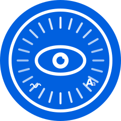
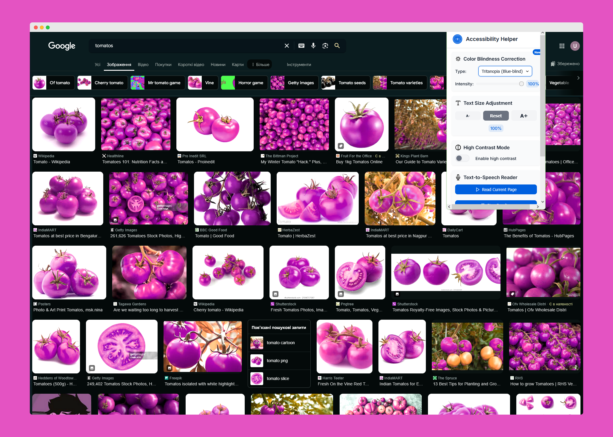
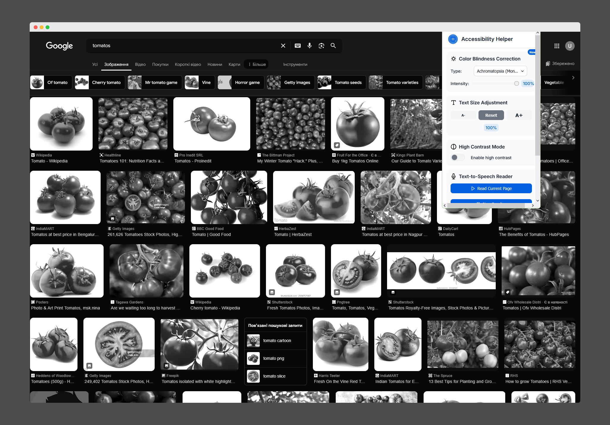
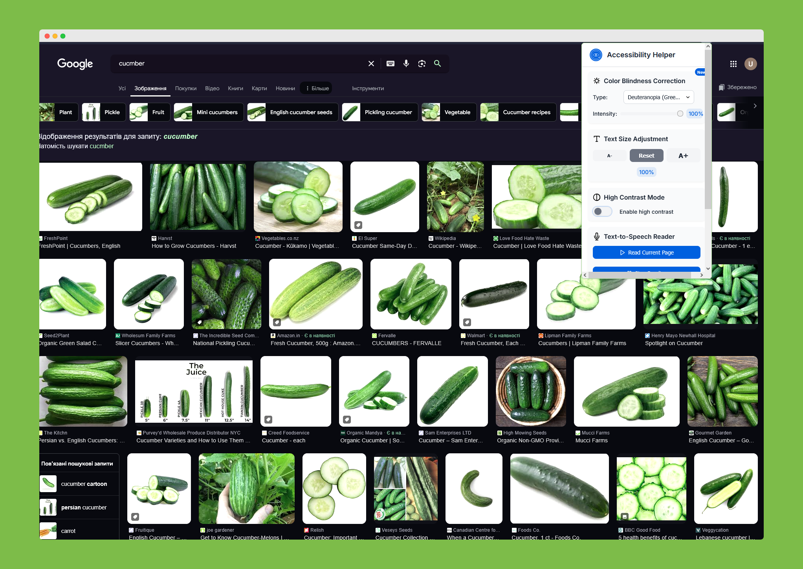
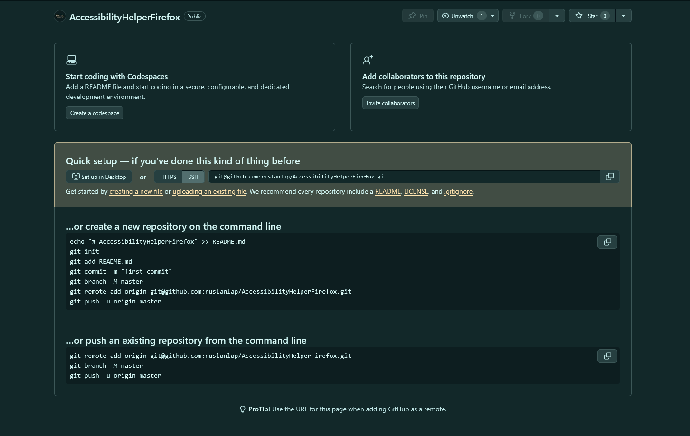
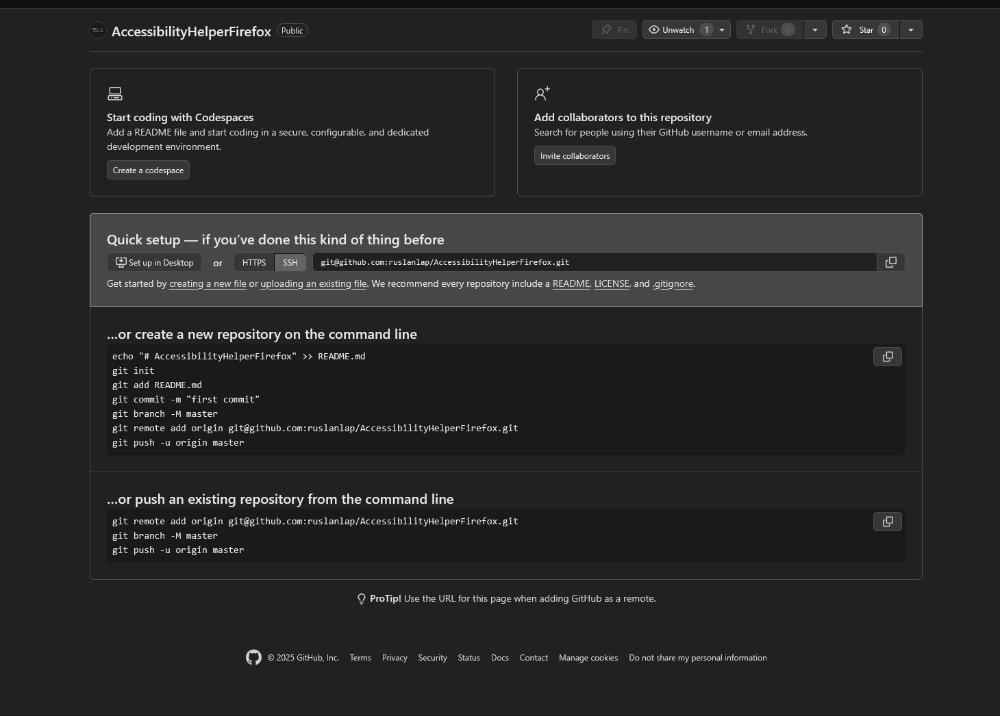
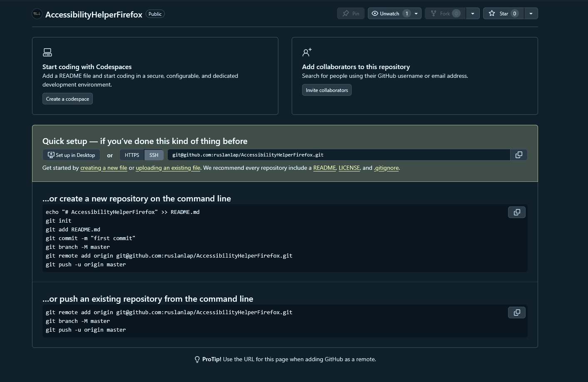

# AccessibilityHelper for Firefox 🌈

[](https://addons.mozilla.org/en-US/firefox/addon/accessibility-helper/)
[](https://github.com/ruslanlap/AccessibilityHelperFirefox/releases)
[](LICENSE)
[](https://www.w3.org/WAI/standards-guidelines/wcag/)
[](https://developer.mozilla.org/en-US/docs/Web/JavaScript)
[](https://makeapullrequest.com)

<div align="center">
    
    <h3>Enhanced Web Accessibility for Everyone</h3>
    <p>
        <a href="https://github.com/ruslanlap/AccessibilityHelperFirefox"><strong>GitHub Repository</strong></a> •
        <a href="https://ruslanlap.github.io/ruslanlap_buymeacoffe/"><strong>Support This Project</strong></a> •
        <a href="Description.md"><strong>Add-on Description</strong></a> •
        <a href="Developer.md"><strong>Developer Guide</strong></a>
    </p>
</div>

## 📋 Table of Contents

- [📸 Screenshots](#-screenshots)
- [🌟 Features](#-features)
- [🚀 Quick Start](#-quick-start)
- [⌨️ Keyboard Shortcuts](#️-keyboard-shortcuts)
- [🛠️ Technical Details](#️-technical-details)
- [🧪 Development](#-development)
- [🤝 Contributing](#-contributing)
- [📝 License](#-license)
- [🔒 Privacy](#-privacy)
- [☕ Support](#-support)
- [👤 Author](#-author)
- [📄 Additional Documentation](#-additional-documentation)

## 📸 Screenshots

<div align="center">
    
    
    
    
    
    
</div>

## 🌟 Features

- 🎨 **Color Blindness Correction**
  - Protanopia (red-blind)
  - Deuteranopia (green-blind)
  - Tritanopia (blue-blind)
  - Achromatopsia (monochromacy)
- 📏 **Text Size Adjustment**
  - Increase/decrease text size on any webpage
  - Custom font scaling options
  - Remember settings per website
- 🔄 **High Contrast Mode**
  - Multiple contrast themes
  - Custom color schemes
  - Inverted colors option
- 🔊 **Text-to-Speech**
  - Read selected text or entire page
  - Adjustable speech rate and pitch
  - Multiple language support

## 🚀 Quick Start

1. Install from [Firefox Add-ons](https://addons.mozilla.org/en-US/firefox/addon/accessibility-helper/)
2. Click the extension icon in your toolbar
3. Choose your accessibility preferences
4. Enjoy a more accessible web!

<div align="center">
    
    
    
    
</div>

## ⌨️ Keyboard Shortcuts

| Shortcut | Action |
|----------|--------|
| `Alt+A` | Open Accessibility Helper |
| `Alt+C` | Toggle high contrast |
| `Alt+.` | Increase text size |
| `Alt+,` | Decrease text size |
| `Alt+R` | Read page aloud |
| `Alt+S` | Stop reading |

## 🛠️ Technical Details

### Project Structure
```
├── background/          # Background scripts
│   └── background.js    # Extension state management
├── icons/               # Extension icons
│   ├── logo.svg         # Main extension logo
│   ├── color-blind.svg  # Feature icons
│   └── ...
├── libs/                # Utility libraries
│   └── color-blind.js   # Color transformation algorithms
├── options/             # Settings page
│   ├── options.html     # Settings UI
│   ├── options.css      # Styles for settings
│   └── options.js       # Settings logic
├── popup/               # Quick access panel
│   ├── popup.html       # Popup UI
│   ├── popup.css        # Styles for popup
│   └── popup.js         # Popup logic
├── assets/              # Documentation assets
│   └── screen1.png      # Screenshots
├── manifest.json        # Extension configuration
└── package.json         # Dependencies and scripts
```

### Technologies

<div align="center">
    
    
    
    
    
</div>

## 🧪 Development

### Prerequisites
- [Node.js](https://nodejs.org/) (v14 or later)
- [web-ext](https://github.com/mozilla/web-ext) for testing and building

### Setup
```bash
# Clone the repository
git clone https://github.com/ruslanlap/AccessibilityHelperFirefox.git
cd AccessibilityHelperFirefox

# Install dependencies
npm install

# Run in Firefox
npm run start

# Build extension
npm run build
```

### Testing in Firefox
1. Open Firefox and navigate to `about:debugging`
2. Click "This Firefox"
3. Click "Load Temporary Add-on..."
4. Select the `manifest.json` file from this project

## 🤝 Contributing

1. Fork the repository
2. Create feature branch (`git checkout -b feature/amazing-feature`)
3. Commit changes (`git commit -m 'Add amazing feature'`)
4. Push to branch (`git push origin feature/amazing-feature`)
5. Open a Pull Request

We welcome contributions of all kinds:
- 🐛 Bug reports and fixes
- ✨ New features
- 📚 Documentation improvements
- 🧪 Test cases

For detailed guidelines on contributing to this project, please see our [Developer Guide](Developer.md).

## 📝 License

This project is licensed under the MIT License - see the [LICENSE](LICENSE) file for details.

## 🔒 Privacy

- No data collection or transmission
- All settings stored locally in browser storage
- No external resources loaded
- No tracking or analytics

## ☕ Support

If you find this extension helpful, consider supporting its development:

<div align="center">
    <a href="https://ruslanlap.github.io/ruslanlap_buymeacoffe/">
        
    </a>
</div>

Your support helps maintain this project and develop new features!

## 👤 Author

**Ruslan**

- GitHub: [@ruslanlap](https://github.com/ruslanlap)
- Project Repository: [AccessibilityHelperFirefox](https://github.com/ruslanlap/AccessibilityHelperFirefox)

## 📄 Additional Documentation

- [Add-on Description](Description.md) - Detailed description used for Mozilla Add-ons submission
- [Developer Guide](Developer.md) - Guidelines for contributing to the project

---

<div align="center">
    <p>Made with ❤️ for improving web accessibility</p>
    <p>© 2025 Ruslan ruslanlap | All Rights Reserved</p>
</div>
